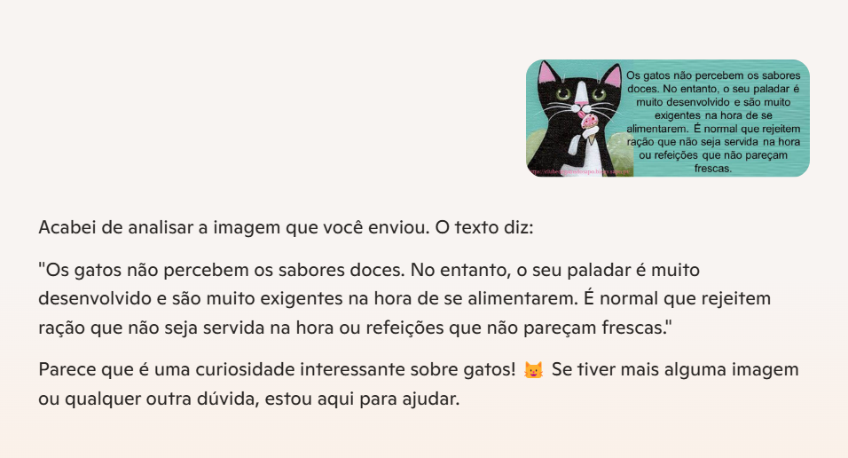
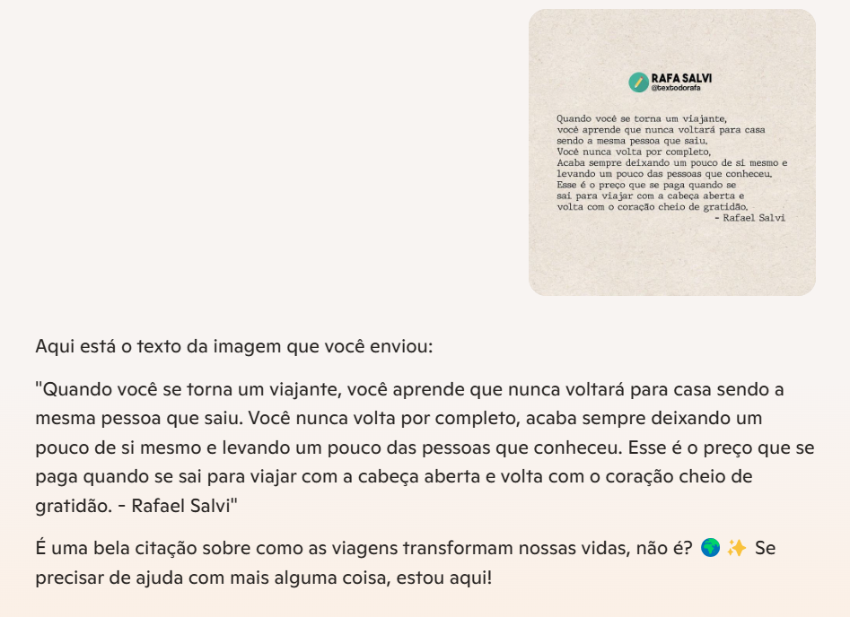
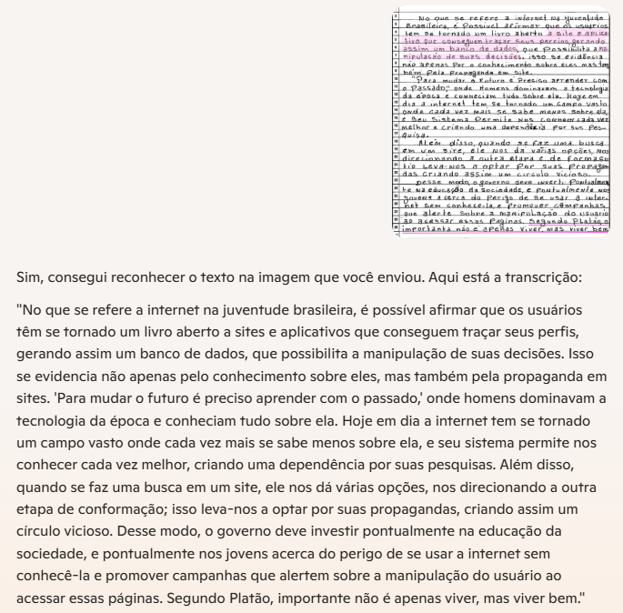

# Projeto Explorando os Recursos de IA Generativa com Copilot e OpenAI

## Instruções do projeto

1. Crie uma pasta chamada 'inputs' e salve as imagens que você utilizou;
2. Crie uma pasta chamado 'output' e salve os resultados de reconhecimento de texto nessas imagens;
3. Crie um arquivo chamado readme.md , deixe alguns prints descreva o processo, alguns insights e possibilidades que você aprendeu durante o conteúdo.

## Primeira imagem

*Resultado do reconhecimento de texto na imagem:*

Reconheceu perfeitamente o texto contido na imagem.

## Segunda imagem

*Resultado do reconhecimento de texto na imagem:*

Texto um pouco maior. Fonte diferente. Reconheceu perfeitamente o texto contido na imagem.

## Terceira imagem

*Resultado do reconhecimento de texto na imagem:*

Essa foi a mais impressionante. Uma carta com um texto grande e escrito a mão. Algumas partes do texto não estão completamente legíveis, o que evidencia a capacidade da ferramenta de reconhecer o texto mesmo contendo irregularidades.

## Insights Finais

Durante o projeto, aprendi sobre o poder e a eficácia da IA generativa, como o Copilot e os recursos de reconhecimento de texto oferecidos pela OpenAI. Aqui estão alguns insights importantes que obtive:

*Reconhecimento Preciso e Versátil:*

A IA demonstrou ser capaz de reconhecer texto de diferentes fontes e tamanhos, incluindo texto em imagens digitais e manuscritos. Essa versatilidade é essencial para diversas aplicações no mundo real.

*Capacidade de Lidar com Irregularidades:*

Fiquei impressionado com a habilidade da ferramenta em reconhecer texto mesmo em condições adversas, como letras manuscritas e imagens com baixa legibilidade. Isso mostra o potencial de uso em situações práticas, como digitalização de documentos históricos e manuscritos.

*Possibilidades de Aplicação:*

As tecnologias de IA generativa podem ser amplamente aplicadas em várias áreas, como educação, onde podem ajudar estudantes a digitalizar e organizar notas manuscritas; em empresas, para automatizar a entrada de dados de documentos físicos; e na preservação de patrimônio cultural, permitindo a digitalização de manuscritos históricos.

*Automatização e Eficiência:*

O uso dessas ferramentas pode aumentar significativamente a eficiência de processos que anteriormente eram manuais e demorados. Isso abre portas para novas formas de trabalhar e gerenciar informações.

A exploração desses recursos de IA generativa proporcionou uma visão clara de como a tecnologia pode impactar positivamente diversas áreas e melhorar a maneira como interagimos com o mundo ao nosso redor.

